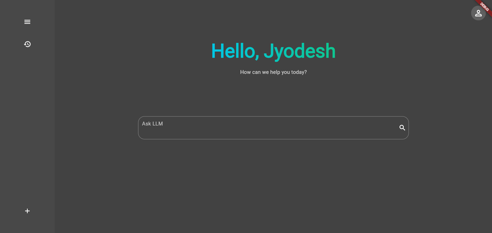
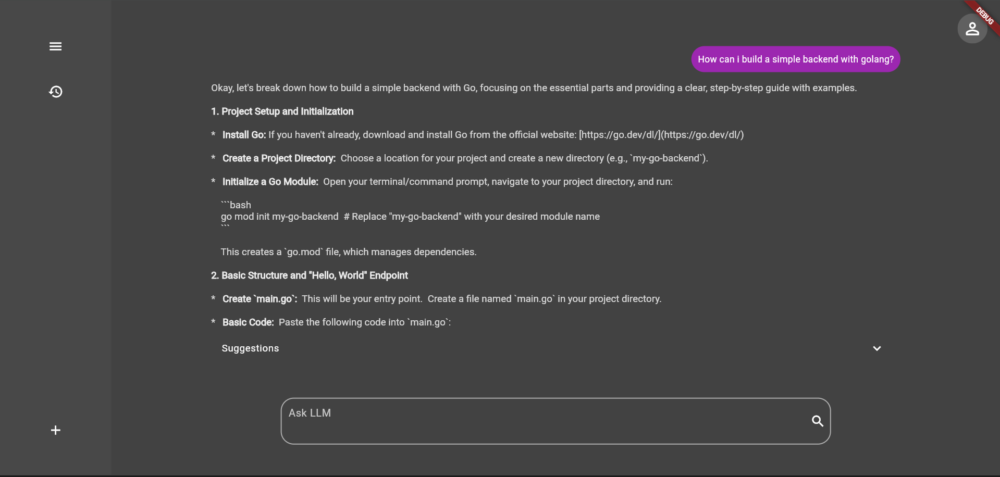

# gpt_web

A Flutter web application that interacts with the Gemini API.

## Features

For help getting started with Flutter development, view the
online documentation, which offers tutorials,
samples, guidance on mobile development, and a full API reference.
*   **Gemini API Integration:** Leverages the power of the Gemini API for responses.
*   **Rate Output:** Users can rate the generated output.
*   **Live Suggestions:** Provides live suggestions as the user types.

## Screenshots

## Contributing

Contributions are welcome! Please open an issue or submit a pull request.
